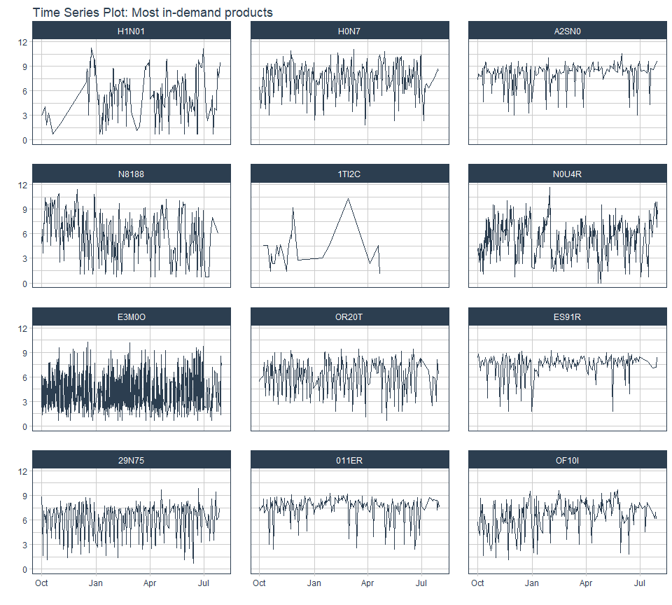
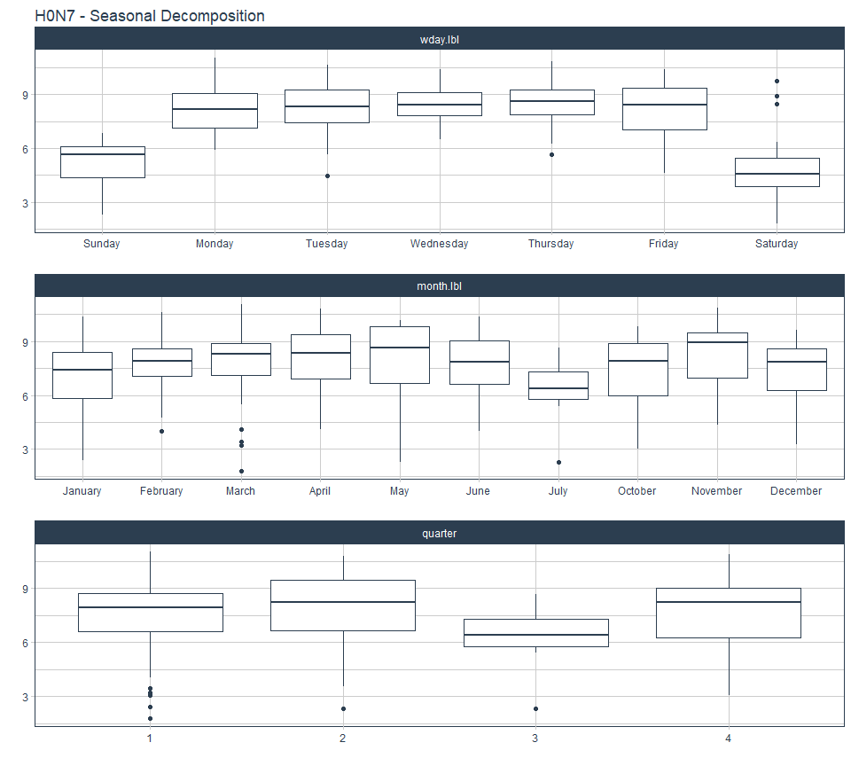

# Big Pharma Product Forecast

The goal of this project is to forecast product demand for Big Pharma, a
large pharmaceutical distribution company in Germany.

**The Business Problem**

Big Pharma restock their warehouses monthly, but often run into issues
with:

1.  Overstocking - having too much of a product available without
    corresponding consumer demand.
2.  Understocking - having too little products available to meet
    consumer demands.

**Tasks**

The goal is to offer Big Pharma a solution to their problem. The
proposed solution is a time series forecast of their product demand. we
begin with a pilot test to forecast the quantity of products the company
should purchase for their warehouses in the coming month.

**Data** Contains product demand data from October 2020 to July 2021
with the following fields:

1.  Date: The date a product was purchased
2.  Product ID: The ID for the product
3.  Stock Demand: The quantity of product purchased (unit is in boxes)

Below is a summary of the data.

    #>       date              product_id       stock_demand      
    #>  Min.   :2020-10-01   N0SI1  :   1482   Min.   :-12226.00  
    #>  1st Qu.:2020-12-10   AL10C  :   1269   1st Qu.:     3.00  
    #>  Median :2021-02-23   ET0N1  :   1259   Median :     9.00  
    #>  Mean   :2021-02-21   V0EL1  :   1250   Mean   :    79.71  
    #>  3rd Qu.:2021-05-04   1PO0L  :   1195   3rd Qu.:    31.00  
    #>  Max.   :2021-07-31   0TR2A  :   1188   Max.   :149004.00  
    #>                       (Other):1040932

### Analysis & Modeling

We have a demand value of `-12226`. However, since stock demand is the
number of boxes of the product that was purchased (according to our meta
data dictionary) then it should not be negative.

Turns out there are quite a number of records (`6,808`) with stock
demand below `0`. To handle this, we make the following assumptions.

**Assumption:**

-   Negative stock demand represents shortage. ie. Customers requested
    the said number of boxes of the product, but they were out of
    stock.  
-   Zero stock demand represents no demand for the product for that day.

In order to accurately forecast the shortages(negative `stock_demand`),
I converted them to positive values and model them as real demand
values. This will ensure stock in the warehouse meets customer demands.

Next, there are over 7000 unique products available for analysis and
forecasting. For this test case,

-   Products for this exercise are restricted to the top 30 products
    based on `stock_demand`.

This allowed me to focus on the most important products and quickly
iterate to generate a working solution.

<!-- -->

Plot below shows the time series plot for the products with the highest
demand over the period under consideration, the y-axis records the
logged values of the `stock_demand`. This makes it easier to identify
seasonal patterns and reduces the variance of the observations which
makes it ideal for modelling. Below is a seasonal decomposition of the
time series plot for one product.

<!-- -->

The plot above helps us identify time components we can include in our
model to capture potential seasonal occurrences. It’s clear demand is
higher during weekdays. On a monthly scale, July seems to have the least
stock demand.

Three models were developed for the problem and configured so that the
most suitable model will be chosen for each individual product.

**Questions**

1.  What evaluation metric would you recommend for your model and why?
    Model performance was assessed using the root mean squared error
    (RMSE) metric, an scaled version of the mean squared error which
    gives indication of how far our prediction was from the actual.The
    RMSE is chosen because it penalizes larger variances between the
    actual and predicted values. Thus, large deviations from the actual
    in either direction are penalized which simulates the financial
    impact of getting predictions wrong. A lower RMSE score is better,
    hence for each product, the model with the lowest RMSE is selected
    to be used for the forecast. The RMSE number is in the same unit as
    the projected value, this is an advantage of this metric in
    comparison to the others. This makes it easier to comprehend.

A table with other metrics that can be used to evaluate each models
performance for each product is included in the final solution for
completeness and transparency.

2.  How would you build a machine learning pipeline for your model? An
    end-to-end pipeline, from data acquisition and cleaning to
    modelling, training and deployment will follow almost the same
    workflow used here. Additional steps would include testing and
    version controlling.

3.  How would you measure the impact your model has on the company’s
    operations? Impact of this model on the company operations could be
    measured by:

<!-- -->

1.  Monetary value of excess stock at the end of the month. In the case
    where the model over estimates customer demand.
2.  Monetary value for product demand over available stock. In the case
    of underestimation resulting in product shortages, this will
    represent missed revenue opportunities and ideally cases of this
    nature should be rare.

These two business metrics will serve as good barometers for how well
the solution is performing and whether or not it requires further
adjustment.

### Deployment

The solution, a time series forecast 30 days into the future, is
deployed on shinyapps.io and can be accessed
[here](https://nii-amoo.shinyapps.io/Big_Pharma_Product_Forecast/?_ga=2.30230655.1728434036.1665487901-2124963698.1665487901).
